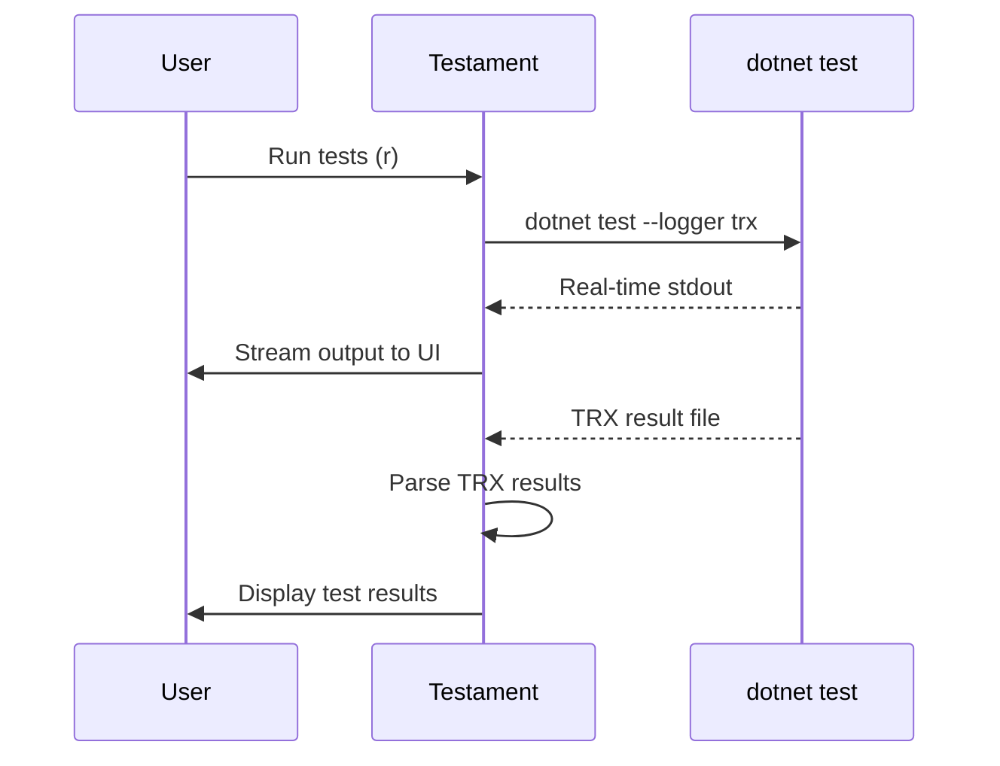

# Testament


## Overview

Testament is a terminal UI application for discovering, running, and monitoring .NET tests. It wraps `dotnet test` with an interactive interface featuring real-time output streaming, watch mode, and keyboard-driven navigation.

Testament solves the problem of managing test execution in large .NET solutions by providing a focused, distraction-free interface that lets you quickly navigate between projects, select specific tests, and view results without leaving the terminal.

## Built With

- [Rust](https://www.rust-lang.org/) - Systems programming language
- [Ratatui](https://ratatui.rs/) - Terminal UI framework
- [Crossterm](https://docs.rs/crossterm/) - Cross-platform terminal manipulation
- [Tokio](https://tokio.rs/) - Async runtime for concurrent test execution
- [quick-xml](https://docs.rs/quick-xml/) - TRX test result file parsing

**External Dependencies:**
- [.NET SDK](https://dotnet.microsoft.com/download) - Required for `dotnet test` execution

## Architecture

**Test Execution Flow:**



## Getting Started

### Prerequisites

- [Rust](https://rustup.rs/) 1.70 or later
- [.NET SDK](https://dotnet.microsoft.com/download) 6.0 or later
- A .NET solution with test projects (xUnit, NUnit, or MSTest)

### Installation

Clone the repository and install:

```bash
git clone https://github.com/craigrusselltiu/testament.git
cd testament
cargo install --path .
```

Alternatively, build without installing:

```bash
cargo build --release
./target/release/testament
```

### Running Testament

Navigate to a directory containing a .NET solution or test project:

```bash
cd /path/to/your/dotnet/solution
testament
```

Testament will automatically:
1. Search upward from the current directory for a `.sln` file
2. Parse the solution to find test projects (projects ending in `Tests` or `Test`)
3. Run `dotnet test --list-tests` to discover individual tests
4. Display projects and tests in the TUI

## Usage

### Keybindings

| Key | Action |
|-----|--------|
| `q` | Quit |
| `b` | Build project only |
| `r` | Run tests (all or selected) |
| `a` | Run failed tests from last run |
| `w` | Toggle watch mode |
| `x` | Clear output |
| `Arrow keys` | Navigate up/down |
| `Tab` | Switch to next pane |
| `Shift+Tab` | Switch to previous pane |
| `Space` | Toggle collapse (on class) or select (on test) |
| `c` | Clear all selections |
| `/` | Start filter mode |
| `Esc` | Clear filter |

### Navigating Panes

1. **Projects** (left) - List of test projects in your solution
2. **Tests** (middle) - Test classes and methods for the selected project
3. **Output** (right) - Test execution output and results

Use `Tab` and `Shift+Tab` to move between panes.

### Running Specific Tests

1. Navigate to the Tests pane with `Tab`
2. Use arrow keys to navigate to a test
3. Press `Space` to select it (repeat for multiple tests)
4. Press `r` to run only selected tests
5. Press `c` to clear selection

### Filtering Tests

1. Press `/` to enter filter mode
2. Type your filter text (case-insensitive)
3. Press `Enter` to apply
4. Press `Esc` to clear the filter

### Watch Mode

Press `w` to enable watch mode. Testament will monitor `.cs` and `.csproj` files and automatically re-run tests when changes are detected.

### Configuration

Create a `.testament.toml` file in your solution directory to customize behavior:

```toml
[runner]
parallel = 4                    # Number of parallel test workers (0 = default)
extra_args = ["--no-build"]     # Additional args passed to dotnet test

[watch]
debounce_ms = 500               # Delay before running tests after file change
patterns = ["*.cs", "*.csproj"] # File patterns to watch
ignore = ["**/obj/**", "**/bin/**"]  # Patterns to ignore
```

## Contributing

Contributions are welcome. Please follow these guidelines:

1. **Fork and branch** - Create a feature branch from `main`
2. **Code style** - Run `cargo fmt` before committing
3. **Linting** - Ensure `cargo clippy` passes without warnings
4. **Testing** - Add tests for new functionality and ensure `cargo test` passes
5. **Pull request** - Submit a PR with a clear description of changes

### Development Commands

```bash
cargo build          # Build the project
cargo run            # Run the TUI
cargo test           # Run tests
cargo clippy         # Lint
cargo fmt            # Format code
```
