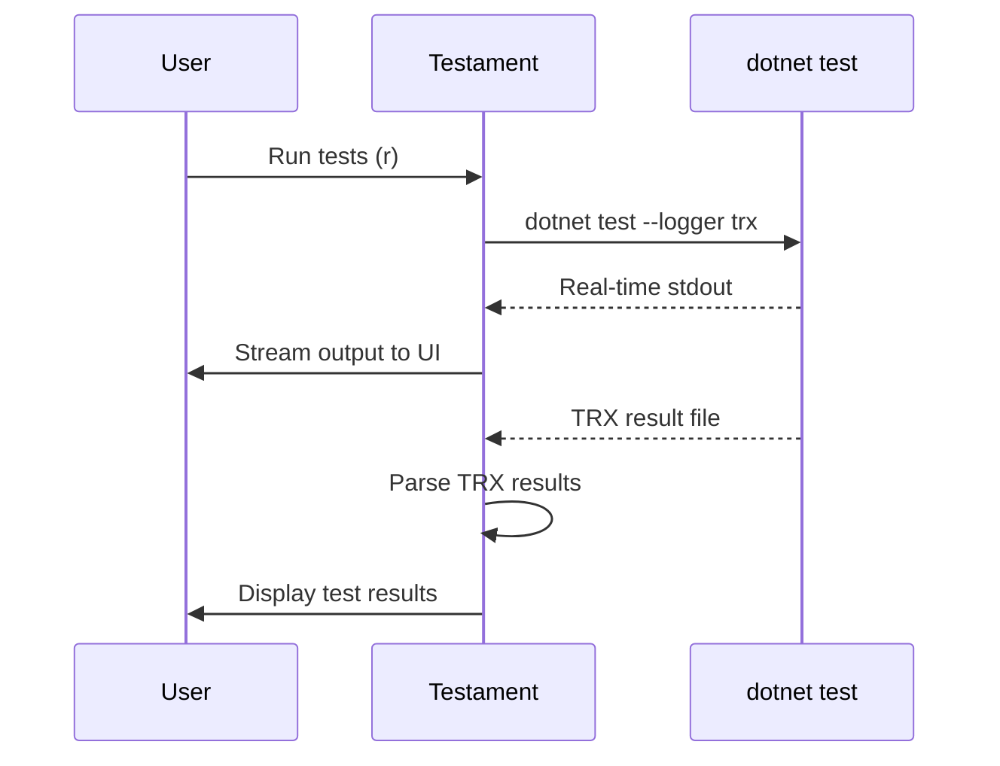

# Testament


**Testament** is a terminal-based test runner wrapper for .NET.

It treats test results as evidence; passing tests stand as a testament to correctness, and failing tests guide the work ahead.

## Overview

Testament is a terminal UI application for discovering, running, and monitoring .NET tests. It wraps `dotnet test` with an interactive interface featuring:

- **Four-pane layout** with projects, tests (grouped by class), output, and test result details
- **Real-time output streaming** during test execution
- **Test class grouping** via C# source parsing with collapsible groups
- **Watch mode** for automatic test re-runs on file changes
- **Lazy test discovery** for instant startup with discovery caching
- **PR test runner** to run only tests changed in a GitHub pull request

Testament solves the problem of managing test execution in large .NET solutions by providing a focused, distraction-free interface that lets you quickly navigate between projects, select specific tests, and view detailed results without leaving the terminal.


## Built With

- [Rust](https://www.rust-lang.org/) - Systems programming language
- [Ratatui](https://ratatui.rs/) - Terminal UI framework
- [Crossterm](https://docs.rs/crossterm/) - Cross-platform terminal manipulation
- [Tokio](https://tokio.rs/) - Async runtime for concurrent test execution
- [quick-xml](https://docs.rs/quick-xml/) - TRX test result file parsing
- [tree-sitter](https://tree-sitter.github.io/) - C# source parsing for test class grouping
- [notify](https://docs.rs/notify/) - File system watching for watch mode

**External Dependencies:**
- [.NET SDK](https://dotnet.microsoft.com/download) - Required for `dotnet test` execution

## Architecture

**Test Execution Flow:**



## Getting Started

### Prerequisites

- [Rust](https://rustup.rs/) 1.70 or later
- [.NET SDK](https://dotnet.microsoft.com/download) 6.0 or later
- A .NET solution with test projects (xUnit, NUnit, or MSTest)

### Installation

Clone the repository and install:

```bash
git clone https://github.com/craigrusselltiu/testament.git
cd testament
cargo install --path .
```

Alternatively, build without installing:

```bash
cargo build --release
./target/release/testament
```

### Running Testament

Navigate to a directory containing a .NET solution or test project:

```bash
cd /path/to/your/dotnet/solution
testament
```

Testament will automatically:
1. Search the current directory for a `.sln` file (or `.csproj` if no solution found)
2. Parse the solution to find test projects (projects ending in `Tests` or `Test`)
3. Run `dotnet test --list-tests` to discover individual tests
4. Display projects and tests in the TUI

## Usage

### Keybindings

| Key | Action |
|-----|--------|
| `q` | Quit |
| `b` | Build project only |
| `r` | Run test under cursor (or class tests, or selected tests) |
| `R` | Run all tests in project |
| `a` | Run failed tests from last run |
| `w` | Toggle watch mode |
| `x` | Clear output |
| `c` | Expand/collapse all classes |
| `C` | Clear all selections |
| `Up/Down` | Navigate within list |
| `Left/Right` | Jump to previous/next test class |
| `Tab` | Switch to next pane |
| `Shift+Tab` | Switch to previous pane |
| `Space` | Toggle collapse (on class) or select (on test) |
| `/` | Start filter mode |
| `Enter` | Apply filter |
| `Esc` | Clear filter |

### Navigating Panes

1. **Projects** (left) - List of test projects in your solution
2. **Tests** (middle) - Test classes (collapsible) and methods for the selected project
3. **Output** (right top) - Test execution output and build results
4. **Test Result** (right bottom) - Details of the selected test (status, duration, error messages, stack traces)

Use `Tab` and `Shift+Tab` to cycle between panes.

### Running Specific Tests

1. Navigate to the Tests pane with `Tab`
2. Use arrow keys to navigate to a test
3. Press `Space` to select it (repeat for multiple tests)
4. Press `r` to run only selected tests
5. Press `c` to clear selection

You can also press `r` on a class to run all tests in that class, or `R` to run all tests in the project.

### Filtering Tests

1. Press `/` to enter filter mode
2. Type your filter text (case-insensitive, matches test and class names)
3. Press `Enter` to apply
4. Press `Esc` to clear the filter

### Watch Mode

Press `w` to enable watch mode. Testament will monitor `.cs` and `.csproj` files and automatically re-run tests when changes are detected.

### PR Test Runner

Run only tests that were added or modified in a GitHub pull request:

```bash
# Launch TUI with only changed tests loaded
testament pr https://github.com/owner/repo/pull/123

# Run tests directly without TUI
testament pr https://github.com/owner/repo/pull/123 --no-tui
```

This command:
1. Fetches the PR diff from GitHub
2. Identifies test projects containing changed test files
3. Extracts test methods from changed files (supports xUnit, NUnit, MSTest)
4. Loads only the changed tests in the TUI (or runs them directly with `--no-tui`)

**Authentication:** Set `GITHUB_TOKEN` environment variable or use `gh auth login`. Without authentication, you may hit GitHub's rate limits.

## Contributing

Contributions are welcome. Please follow these guidelines:

1. **Fork and branch** - Create a feature branch from `main`
2. **Code style** - Run `cargo fmt` before committing
3. **Linting** - Ensure `cargo clippy` passes without warnings
4. **Testing** - Add tests for new functionality and ensure `cargo test` passes
5. **Pull request** - Submit a PR with a clear description of changes

### Development Commands

```bash
cargo build          # Build the project
cargo run            # Run the TUI
cargo test           # Run tests
cargo clippy         # Lint
cargo fmt            # Format code
```
